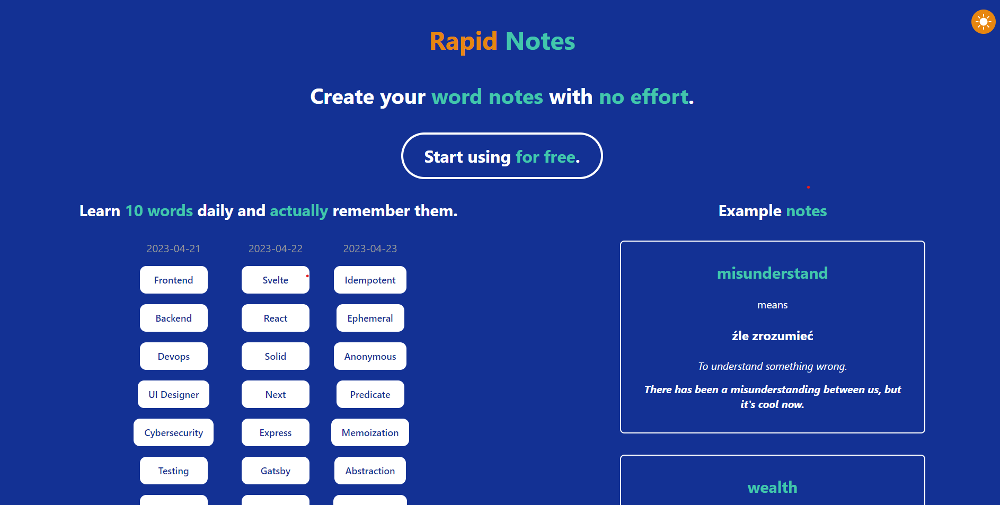
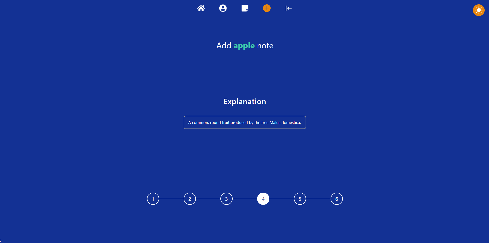
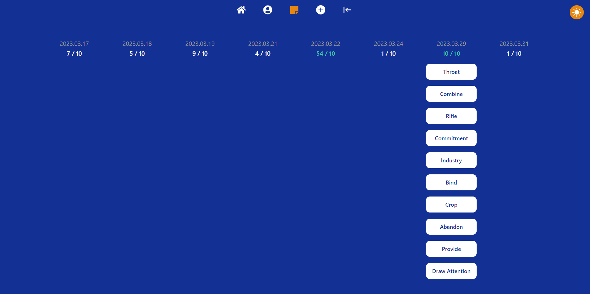
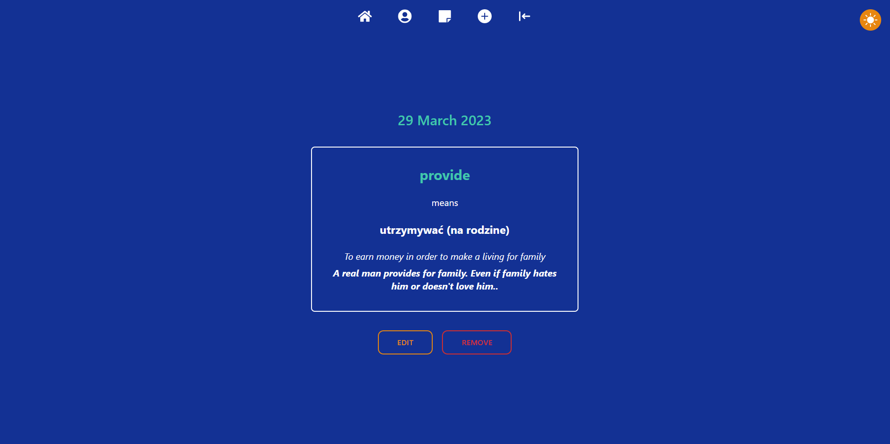
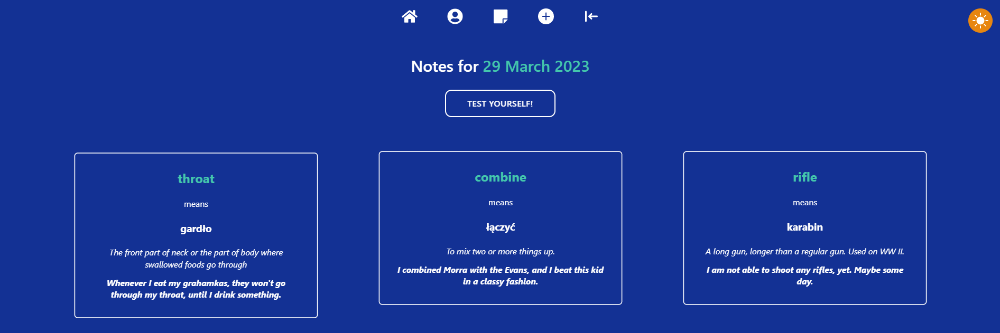
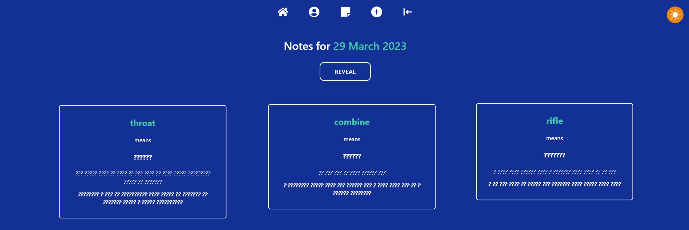

# 📝 Rapid Notes

# 🔍 Preview links :
- [Home page](https://notes-rho-ashy.vercel.app/)

# 📖 Table of Contents

- [🅰️ About the app](#🅰️-about-the-app)
  - [🚀 Features](#🚀-features)
- [💡 Motivation](#💡-motivation)
- [🚀 Technology stack](#🚀-technology-stack)
- [🖼️ Screenshots](#🖼️-screenshots)
  - [🏠 Home page](#🏠-home-page)
  - [👤 Profile page](#👤-profile-page)
  - [📝 Add a new note form](#📝-add-a-new-note-form)
    - [📝 Example form step](#📝-example-form-step)
  - [📝 Notes](#📝-notes)
    - [🗒️ All notes page](#🗒️-all-notes-page)
    - [📝 Single note page](#📝-single-note-page)
    - [📆 Notes page for a particular day](#📆-notes-page-for-a-particular-day)
      - [🧑‍🎓 Test yourself](#🧑‍🎓-test-yourself)
- [📧 Contact](#📧-contact)

# 🅰️ About the app
Application for learning and studying words / phrases in English.

## 🚀 Features
- creating and managing your own definitions of words / phrases (with dictionaryapi suggestions)
- tests for created definitions
- managing your profile (avatar and username)

# 💡 Motivation
My motivation was to create an app, where I can learn new phrases in English, using my own method, which is :

1. Read the dictionary definition
2. Translate it to your native language
3. Explain it in English
4. Come up with some example for this word / phrase
5. When you have 10 words / phrases, test yourself

And that's exactly how my app works, you learn new phrases following this whole process.

# 🚀 Technology stack

- [Next 13 (React)](https://nextjs.org/) - For front-end
- [Typescript](https://www.typescriptlang.org/) - For type safety
- [Tailwind](https://tailwindcss.com/) - For styling
- [supabase](https://supabase.com/) - As the database, storage and for back-end
- [Prisma](https://www.prisma.io/) - As a ORM for database
- [Formik](https://formik.org/) - For managing forms
- [Framer Motion](https://framer.com/motion) - For animations and transitions between pages
- [Vercel](https://vercel.com/) - For deployment

# 🖼️ Screenshots

## 🏠 Home page

## 👤 Profile page

## 📝 Add a new note form
### 📝 Example form step

## 📝 Notes
### 🗒️ All notes page

### 📝 Single note page

### 📆 Notes page for a particular day

#### 🧑‍🎓 Test yourself

# 📧 Contact
Feel free to contact me, message me on Discord @macias#9277 😄🙏.